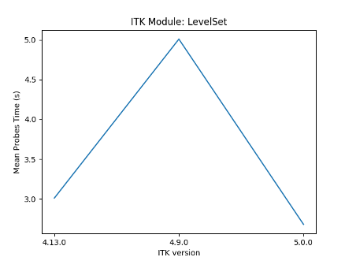
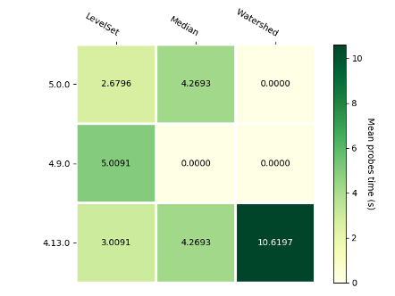

ITKPerformancePlot
==================

.. image:: https://img.shields.io/badge/License-Apache%202.0-blue.svg?style=shield
   :target: https://github.com/jhlegarreta/ITKPerformancePlot/blob/master/LICENSE

Overview
--------

A module to plot `ITK <https://github.com/InsightSoftwareConsortium/ITK>`_
`performance benchmarking <https://github.com/InsightSoftwareConsortium/ITKPerformanceBenchmarking>`_
data.

Data
----

Three dataset are provided for the purpose of demonstrating the visualization
capabilities of the module:

- `simplified_data.tar.gz <./example_data/simplified_data.tar.gz>`_: a
  reduced set of files, primarily intended as a restricted benchmarking
  dataset.
- `scatter_os_data.tar.gz <./example_data/scatter_os_data.tar.gz>`_: a dataset
  that is intended to demonstrate the capabilities of the scatter plot
  visualization method, and provide a means to compare the performance of a
  module across different platforms and ITK versions.
- `clay_data.tar.gz <./example_data/clay_data.tar.gz>`_: original ``clay``
  `benchmarking files <https://data.kitware.com/#folder/5afa58368d777f0685798c5b>`_
  hosted at `data.kitware.com <https://data.kitware.com>`_, a dataset intended
  to fully exercise the module.

Note that the ``JSON`` files in the
`simplified_data.tar.gz <./example_data/simplified_data.tar.gz>`_ and the
`scatter_os_data.tar.gz <./example_data/scatter_os_data.tar.gz>`_ were
**manually edited** from the original ``clay``
`benchmarking files <https://data.kitware.com/#folder/5afa58368d777f0685798c5b>`_
hosted in the `data.kitware.com <https://data.kitware.com>`_ to simulate
benchmarks for ITK versions that were not present in the original ``clay``
dataset, as well as to give rise to some situations (e.g. modules not present in
some ITK versions, different number of time probes across modules or versions,
etc.) that could potentially arise when benchmarking ITK modules across time.
Thus, they may not reflect actual ITK module performances.

The visualization scripts were tested on all three datasets using Python 3.6.5.

Usage
-----

Please follow the steps described:

1. Clone the repository.
2. Install Python.
3. Install the requirements using the `requirements.txt <requirements.txt>`_
   file provided.
4. Run the example visualization program on the input dataset by providing the
   folder where the (uncompressed) benchmarking ``JSON`` files are located, and
   provide a filename for the ``JSON`` summary, e.g.::

    python ./examples/itk_performance_benchmarking.py ./example_data/clay ./output/summary.json

Example visualizations
----------------------

These example visualizations were created using the ``JSON`` files contained in
the `scatter_os_data.tar.gz <./example_data/scatter_os_data.tar.gz>`_ example
dataset.

Module error bar plot:

Module scatter plot:

.. image:: results/ITK_PerformanceBenchmarking-Module_vs_ITK_version_OS_scatterplot_LevelSet.png

Historical heatmap:

License
-------

This software is distributed under the Apache 2.0 license. Please see the
*LICENSE* file for details.
