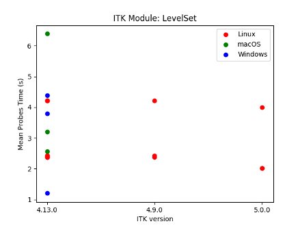

ITKPerformancePlot
==================

.. image:: https://img.shields.io/badge/License-Apache%202.0-blue.svg?style=shield
   :target: https://github.com/jhlegarreta/ITKPerformancePlot/blob/master/LICENSE

Overview
--------

ITK performance benchmarking plots.

Example visualizations
----------------------

These example visualizations were created using modified versions of the JSON
files contained in `scatter_os_data.tar.gz <./example_data/scatter_os_data.tar.gz>`_.
Note that these JSON files were **manually edited** from the original ``clay``
`benchmarking files <https://data.kitware.com/#folder/5afa58368d777f0685798c5b>`_
hosted in the `data.kitware.com <https://data.kitware.com>`_ to give rise to
some situations (e.g. modules not present in some ITK versions, different
number of time probes across modules or versions, etc.) that could potentially
arise when benchmarking ITK modules across time. Thus, they may not reflect
actual ITK module performances.

Module error bar plot:

.. image:: results/ITK_PerformanceBenchmarking-Module_vs_ITK_version_errorbar_LevelSet.png

Module scatter plot:

Historical heatmap:

License
-------

This software is distributed under the Apache 2.0 license. Please see the
*LICENSE* file for details.
